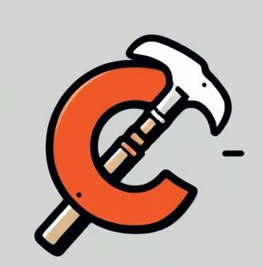

## Overview
Hammer is a portable and user-friendly set of tools to manage C and C++ projects.

It's a hacky attempt to provide a compact CLI a-la Cargo (Rust's build tool) to configure C/C++ projects
on Linux and Windows, with provided integrations to several development tools that
one would otherwise have to integrate on their own. 

The base idea is to try and decouple as much as possible the source code from how it is built;
to simply have a tool that can take care of compilation of a wide number of projects easily.
  The tool should be simple enough for the developer to pick up without having to worry about
knowing any CMake or other build tools.

This is much like what the [Zig](https://ziglang.org) project is striving for with its incredible toolchain.
Using CMake currently simplifies legacy support and modularity (e.g. by allowing for multiple compilers).

### Features

* CLI utilities to setup, configure and build new and existing projects
* Build targets are configured via yaml files
* Support for multiple compilers, linkers and build systems
* Currently only linux (Debian-based) is supported, but this will be expanded

### Future features
* Windows support
* Add your own toolchains with one command
* Dependency management integration with [VCPKG](https://vcpkg.io/en/) and [Conan](https://conan.io/)
* Installing and uninstalling tools like linters and static analysis
* Linting
* Emit documentation
* Test coverage reports
* Static analysis tools integration

### Tools involved

* The back-end uses [CMake](https://cmake.org) for configuration.
This is what does most of the heavy lifting, and allows the entire thing to be cross platform and support
multiple buildsystems such as GNU Make, Ninja, Visual Studio...

* The front-end CLI the user interacts with is written in [Zig](https://ziglang.org/); other than being a great
language it comes with an amazing toolchain, which allows for easy cross-compilation to a wide set of targets.

* The CLI uses [CYaml](https://github.com/tlsa/libcyaml) to compile (or better transpile) the user's yaml configuration files
  into CMake files for the back-end.

* When configuring the project, the CLI calls on graphical configuration programs that are built for CMake: 
[ccmake](https://cmake.org/cmake/help/latest/manual/ccmake.1.html) or [cmake-gui](https://cmake.org/cmake/help/latest/manual/cmake-gui.1.html);
by default the project uses ccmake, but when compiling from source this can be changed so it uses cmake-gui.

All Hammer is, at the end of the day, is a collection of freely accessible tools and frameworks, packaged in a way that 
makes them hopefully more convenient to use.

However, in places where a choice had to be made between control and convenience, control was always favored.
the goal is to make the developer feel that using Hammer as a build assistant gives them no less knowledge or
control over the project than they would have had with some other tool.

## Design
The user interacts with a front-end CLI that takes heavy inspiration from Rust's Cargo.
It provides a few quick commands to organize a project:

   $ hammer config
   $ hammer build
   $ hammer docs
    
## Installation
Currently, Linux only.

    $ sudo ./installers/fetch-dependencies.sh
    $ sudo ./install

## Packages
Hammer comes with support for integration of several tools, such as testing frameworks and
static code analysis tools. The package system is so bare-bones it barely
classifies as such; all it is, really, is a ready-made collection of bash scripts
that are meant for the user to quickly fetch a dependency without fighting too much
with their system in order to start using it.

e.g.

    $ hammer install codeql

And that's it, the script starts and you're ready to go.

Each installation script comes with an associated uninstall script,
which the user can simply run with

    $ hammer uninstall codeql

And if you get tired of using hammer? Tell it to off itself.

    $ hammer uninstall hammer

## Getting started

A quick guide to writing your first C/C++ program with hammer.

### Create a repo

    $ hammer new MyAwesomeRepo
    $ cd MyAwesomeRepo

### Configuring the project

    $ hammer config

  Enable, disable and edit any configuration parameter you please. You may toggle the advanced
  options to display all the options which are hidden by default.

  You'll need to configure and generate a Makefile/Ninjafile/other (knowledge of CMake comes in handy here)

  All build artifacts so far and those coming later are stored under a default build/ directory;
  when configuring one may specify their desired build dir or generator by going

    $ hammer config buildHere -G "Unix Makefiles"

  (again, the CMake user will find this familiar)

### Building the project
  Fairly straight-up:

    $ hammer build              # default build/ directory
    $ hammer build buildHere    #  chosen build directory

### Check the binary
  You'll find your emitted binaries under build/bin/
  If what you configured is an executable (as per default), you may simply run it with:

    $ hammer run
    $ hammer run buildHere

## Project structure

Hammer is divided in a Zig front-end (the CLI binary that the interacts with) and a collection of CMake and Bash scripts
in the back-end that get selectively invoked by the front-end.

The most important function the CLI performs is reading the yaml configuration files under the .configure/ directory and
compiling them into cmake files to be used during configuration.

## Going from here
There's really nothing new under the sun here. Hammer is just packaging some scripts and utilities, check out
what it has available by running 

    $ hammer help

  and see if any of the available features and packages interest you.

## Contact

  If you find this tool of any help, you will no doubt find many many issues with it.
  Many features are currently only hacky stubs of the kind-of-works-but-not-quite variety.

  Any question, comment, suggestion, request and especially code are very much appreciated!
  Feel free to reach out to me at [tommaso.murolo@gmail.com](mailto:tommaso.murolo@gmail.com).
